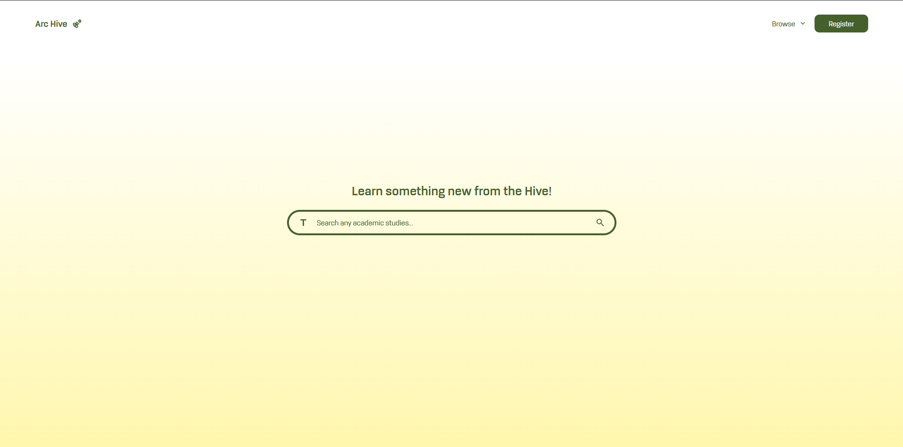
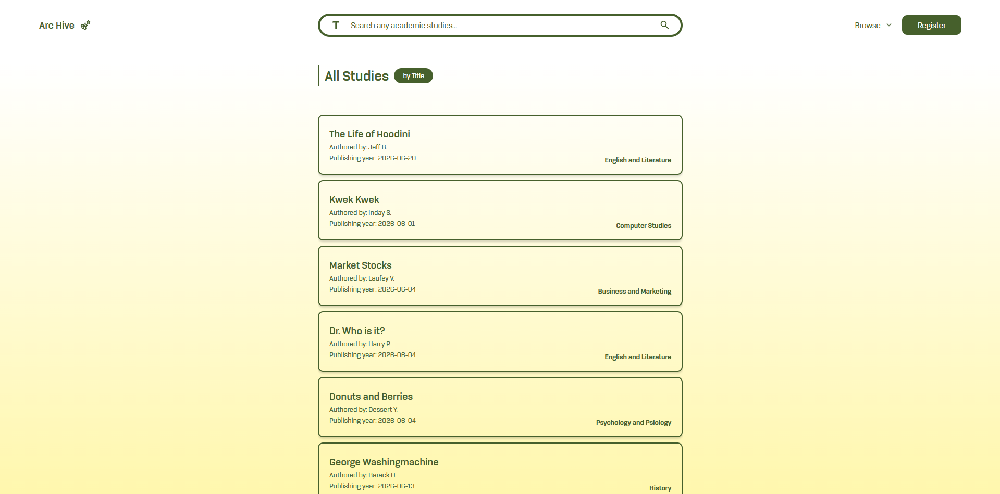
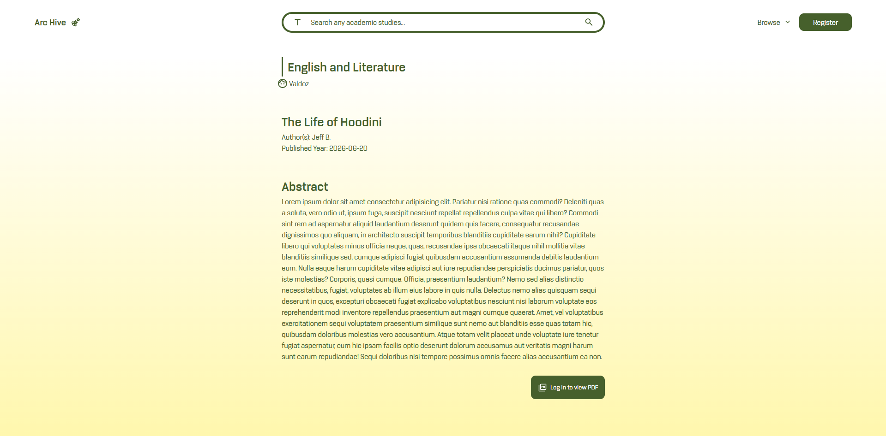
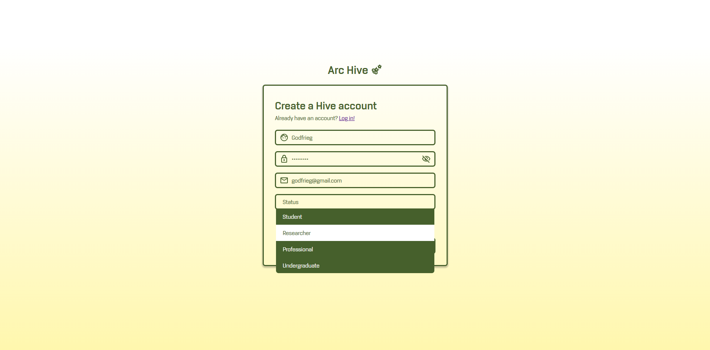

# Research and Assignment Paper Archive System



A PHP-based system for archiving research and assignment papers using `.txt` files as a database.

This design is intentional and was chosen to better understand how PHP handles data management without relying on traditional database systems. The use of text files as a database was also a requirement imposed by the course instructor.

This project was developed as a Midterm requirement for **CIP 1102: Integrative Programming and Technologies**.

## Features

* Account CRUD (Create, Read, Update, Delete)
* Basic Search Functionality
* Research Paper Filtering
* Research and Assignment Paper Archiving

## Technologies Used

* PHP
* HTML
* JavaScript

## Screenshots

* Homepage with listed available archives



* View page of an archive
  


* Register form
  


## Installation

1. Clone the repository:

```bash
git clone https://github.com/Poufles/research-archives-on-php.git
```

2. Inside the project directory, create a folder named `database`.

3. Inside the `database` folder, create the following directories:

```text
database/
├── directories/
└── user_data/
```

4. Run the project on a local PHP server (e.g., XAMPP, Laragon, WAMP).

The installation is now complete.

## Developers

* Poufles
* cescaJ

## Academic Information

**Course:** CIP 1102 – Integrative Programming and Technologies

**Purpose:** Midterm Project
